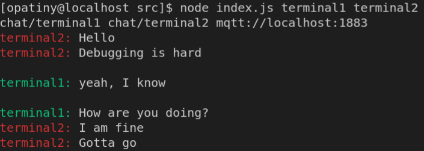
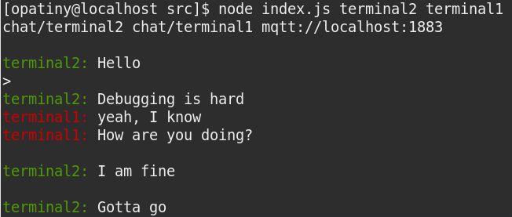

# mqtt-chat

Allows you to chat between two terminals using MQTT

## Usage
To use this project, you must have access to a running MQTT broker. Clone the project and enter the directory.

This project uses three command line arguments: your username, the username of the other person you want to talk with, and optionally, the broker address.

Use the following command to run the project.

```bash
node index.js <username1> <username2> <broker>
```

The default broker is `localhost:1883`.

### Example

If you have an MQTT broker running locally, run this in a first terminal:

```bash
node index.js terminal1 terminal2
```

And this in a second terminal:
```bash
node index.js terminal2 terminal1
```

This is what terminal 1 will contain after a few messages where exchanged:



This is what terminal 2 will contain after a few messages where exchanged:



## License

[MIT](./LICENSE)
